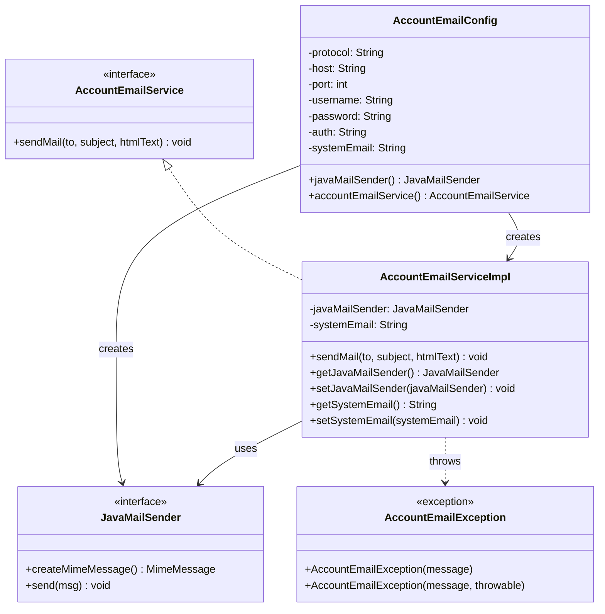
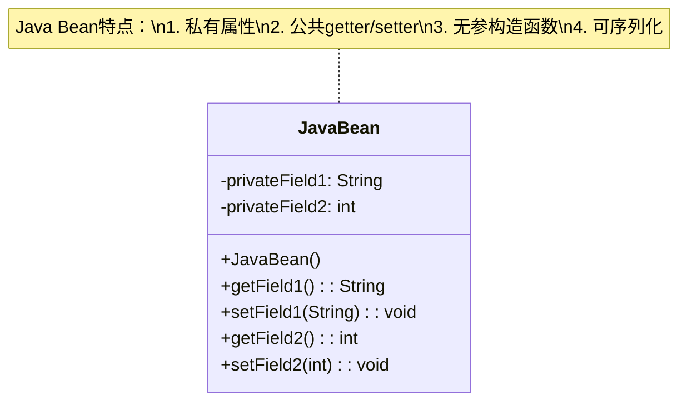
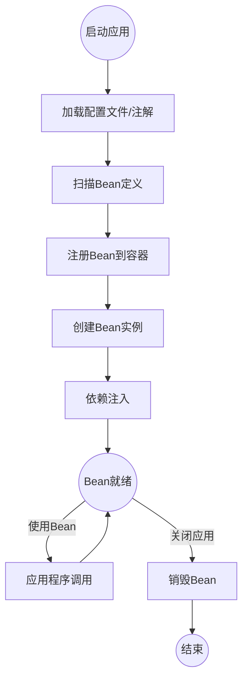
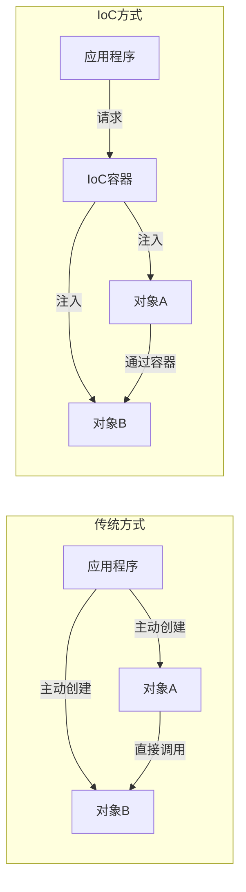
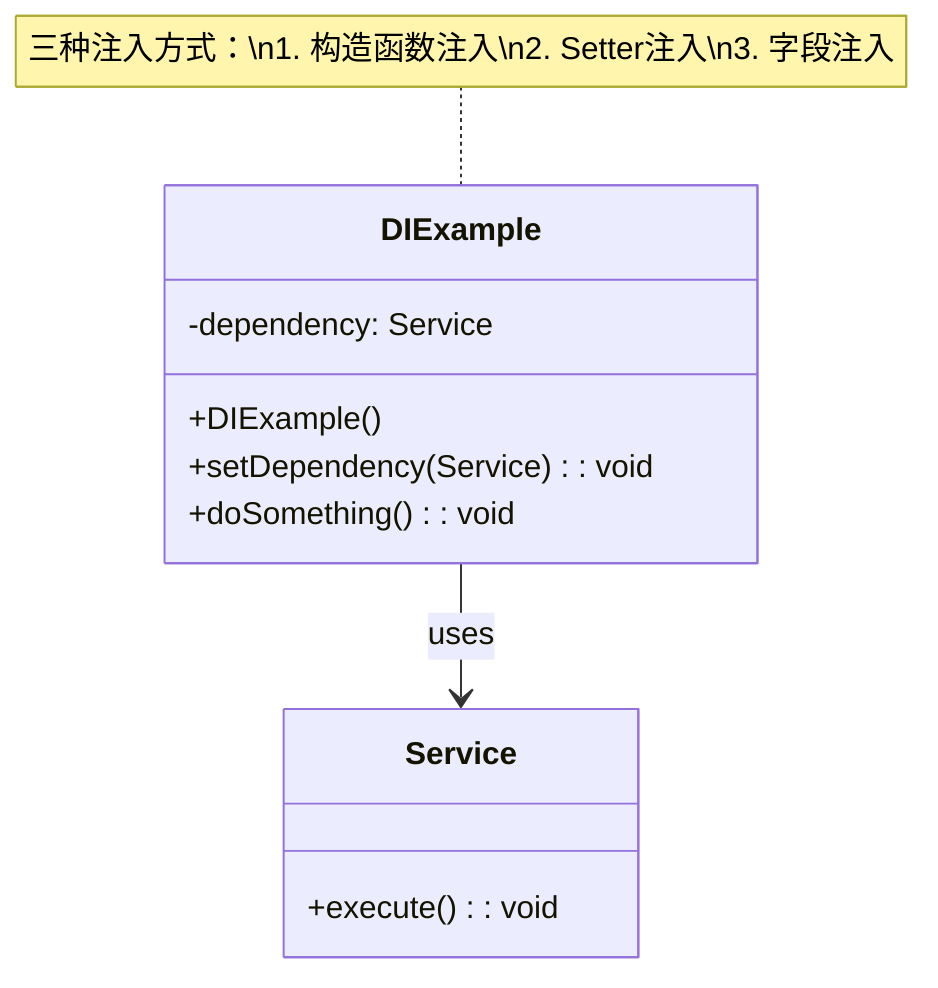
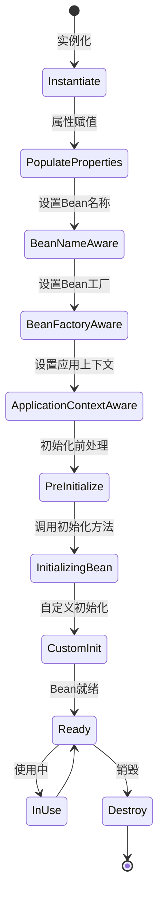
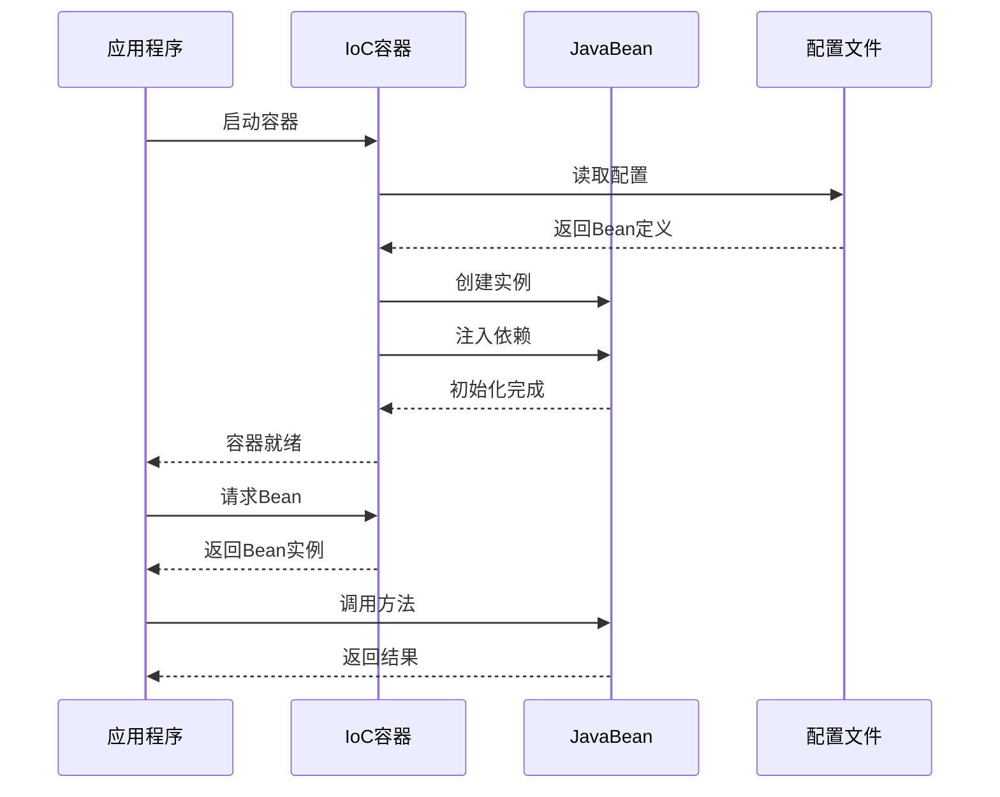

# ch5项目 - 账户邮件服务

## 项目概述

ch5项目是一个基于Spring框架的邮件服务模块，提供了发送HTML邮件的功能。该项目展示了如何使用Spring的依赖注入和配置管理来构建一个可配置的邮件服务。

## 项目基本信息

- **GroupId**: com.juven.mvnbook.account
- **ArtifactId**: account-email
- **Version**: 1.0.0-SNAPSHOT
- **Java版本**: 21
- **框架**: Spring 6.2.4

## 代码功能解释

### 核心组件

#### 1. AccountEmailService (接口)

```java
public interface AccountEmailService {
    void sendMail(String to, String subject, String htmlText) throws AccountEmailException;
}
```

- **作用**: 定义邮件服务的接口契约
- **方法**: `sendMail` - 发送HTML格式的邮件

#### 2. AccountEmailServiceImpl (实现类)

- **作用**: 邮件服务的具体实现
- **功能**:
  - 使用Spring的JavaMailSender发送邮件
  - 支持HTML格式的邮件内容
  - 异常处理和转换

#### 3. AccountEmailConfig (配置类)

- **作用**: Spring配置类，负责Bean的创建和配置
- **功能**:
  - 配置JavaMailSender（邮件发送器）
  - 配置邮件服务参数（协议、主机、端口等）
  - 从properties文件读取配置

#### 4. AccountEmailException (异常类)

- **作用**: 自定义邮件服务异常
- **功能**: 封装邮件发送过程中的异常信息

## UML类图



## 设计模式分析

### 1. 依赖注入模式 (Dependency Injection)

- **实现**: 通过Spring框架实现
- **体现**:
  - `AccountEmailServiceImpl` 通过setter方法注入 `JavaMailSender`
  - `AccountEmailConfig` 负责创建和配置Bean
- **优点**: 松耦合，易于测试和维护

### 2. 模板方法模式 (Template Method)

- **实现**: Spring的 `JavaMailSender` 接口
- **体现**: 提供了发送邮件的标准流程，具体实现由子类完成
- **优点**: 封装了邮件发送的复杂逻辑

### 3. 工厂模式 (Factory Pattern)

- **实现**: `AccountEmailConfig` 作为Bean工厂
- **体现**: 创建和配置 `JavaMailSender` 和 `AccountEmailService` 实例
- **优点**: 集中管理对象的创建和配置

### 4. 策略模式 (Strategy Pattern)

- **实现**: `AccountEmailService` 接口定义了邮件发送策略
- **体现**: 不同的实现可以提供不同的邮件发送策略
- **优点**: 易于扩展新的邮件发送方式

## 依赖分析和优化

### 原始依赖问题

通过 `mvn dependency:analyze` 分析发现：

- **未声明的已使用依赖**:
  - `org.junit.jupiter:junit-jupiter-api` (测试使用)
  - `org.springframework:spring-beans` (Spring框架核心)
- **未使用的已声明依赖**:
  - `org.eclipse.angus:angus-mail` (邮件实现，但使用GreenMail测试)
  - `org.junit.jupiter:junit-jupiter` (聚合依赖，应使用具体模块)
  - `org.mockito:mockito-junit-jupiter` (测试扩展，可移除)
  - `ch.qos.logback:logback-classic` (日志框架，项目未使用)

### 优化后的依赖配置

```xml
<dependencies>
    <!-- Spring Framework -->
    <dependency>
        <groupId>org.springframework</groupId>
        <artifactId>spring-context</artifactId>
        <version>6.2.4</version>
    </dependency>
    <dependency>
        <groupId>org.springframework</groupId>
        <artifactId>spring-context-support</artifactId>
        <version>6.2.4</version>
    </dependency>
    
    <!-- Jakarta Mail API -->
    <dependency>
        <groupId>jakarta.mail</groupId>
        <artifactId>jakarta.mail-api</artifactId>
        <version>2.1.3</version>
    </dependency>
    
    <!-- Mail Implementation (生产环境需要) -->
    <dependency>
        <groupId>org.eclipse.angus</groupId>
        <artifactId>angus-mail</artifactId>
        <version>2.0.3</version>
    </dependency>

    <!-- Test Dependencies -->
    <dependency>
        <groupId>org.springframework</groupId>
        <artifactId>spring-test</artifactId>
        <version>6.2.4</version>
        <scope>test</scope>
    </dependency>
    <dependency>
        <groupId>org.junit.jupiter</groupId>
        <artifactId>junit-jupiter-api</artifactId>
        <version>5.11.4</version>
        <scope>test</scope>
    </dependency>
    <dependency>
        <groupId>org.junit.jupiter</groupId>
        <artifactId>junit-jupiter-engine</artifactId>
        <version>5.11.4</version>
        <scope>test</scope>
    </dependency>
    <dependency>
        <groupId>org.mockito</groupId>
        <artifactId>mockito-core</artifactId>
        <version>5.5.0</version>
        <scope>test</scope>
    </dependency>
  <dependency>
   <groupId>com.icegreen</groupId>
   <artifactId>greenmail</artifactId>
   <version>2.0.1</version>
   <scope>test</scope>
  </dependency>
  
  <!-- SLF4J Simple Implementation for testing -->
  <dependency>
   <groupId>org.slf4j</groupId>
   <artifactId>slf4j-simple</artifactId>
   <version>1.7.36</version>
   <scope>test</scope>
  </dependency>
 </dependencies>
```

### 优化效果

- **依赖精简**: 移除了未使用的日志依赖和测试扩展
- **明确依赖**: 使用具体的JUnit模块而非聚合依赖
- **功能完整**: 保留了所有必要的生产和测试依赖
- **验证结果**: 项目构建和测试全部通过，依赖警告大幅减少

### 最终依赖状态

优化后依赖分析显示：

- **剩余未声明的已使用依赖**: `spring-beans` (Spring框架核心，通过spring-context传递)
- **剩余未使用的已声明依赖**: `angus-mail` (生产环境需要)，`junit-jupiter-engine` (测试运行需要)

这些剩余警告是合理的，因为：

- `spring-beans` 是Spring框架的核心组件，通过传递依赖引入
- `angus-mail` 在生产环境中是必需的邮件实现
- `junit-jupiter-engine` 是JUnit测试运行的必要组件

### 运行时警告说明

在测试运行过程中可能会出现以下警告，这些是正常的：

1. **Mockito Java Agent警告**: Mockito框架动态加载字节码操作代理，用于模拟对象的创建
2. **JVM共享类警告**: 由于字节码操作，JVM会显示关于类共享的警告

这些警告不影响项目的功能，是Mockito框架的正常行为。在生产环境中不会出现这些警告。

## 配置文件说明

### service.properties

```properties
email.protocol=smtp
email.host=localhost
email.port=2500
email.username=test@juvenxu.com
email.password=123456
email.auth=true
email.systemEmail=test1@juvenxu.com
```

## 测试说明

项目包含两种测试：

1. **单元测试** (`AccountEmailServiceUnitTest`): 使用Mockito模拟依赖
2. **集成测试** (`AccountEmailServiceTest`): 使用GreenMail模拟邮件服务器

## 运行项目

```bash
# 构建项目
cd ch-5/account-email
mvn clean package

# 运行测试
mvn test

# 安装到本地仓库
mvn install
```

## 项目总结

ch5项目展示了：

- 如何使用Spring框架构建服务模块
- 依赖注入和配置管理的最佳实践
- 邮件服务的完整实现
- 单元测试和集成测试的编写
- Maven依赖管理的优化

该项目可以作为企业级邮件服务的基础模块，具有良好的扩展性和可维护性。

## 更详细的技术解释

### IOC

- IOC（控制反转）是一种设计模式，用于将对象的创建和依赖管理从应用程序代码中分离出来。在Spring框架中，IOC容器负责管理对象的创建和依赖注入。
- DI（依赖注入）是IOC的一种实现方式，通过将依赖对象注入到目标对象中，实现对象之间的解耦。Spring框架支持多种DI方式，包括构造函数注入、Setter注入和字段注入。
- Spring Bean是Spring框架中的基本构建块，表示一个由Spring容器管理的对象。Bean的生命周期包括实例化、属性赋值、初始化、销毁等阶段。

#### 1. Java Bean 结构图



#### 2. IoC容器工作流程图



#### 3. IoC控制反转对比图



## 4. 依赖注入类型图



### 5. Spring Bean生命周期图



## 6. 完整示例流程图



### 关键概念说明

#### 1. Java Bean

- 是一种可重用的软件组件
- 遵循特定的命名规范
- 支持内省（Introspection）
- 可以序列化

#### 2. IoC（控制反转）

- 将对象的创建和依赖关系的管理交给容器
- 实现了松耦合
- 提高了代码的可测试性和可维护性

##### 3. 依赖注入

- 是IoC的具体实现方式
- 通过构造函数、setter或字段注入依赖
- 由容器负责组装组件

##### 4. Spring容器

- 负责Bean的生命周期管理
- 处理Bean之间的依赖关系
- 提供配置和管理功能

#### 实际应用示例

##### Java Bean实现

```java
public class SystemConfig {
    private String systemEmail;
    private String systemName;
    
    public SystemConfig() {}
    
    public String getSystemEmail() {
        return systemEmail;
    }
    
    public void setSystemEmail(String systemEmail) {
        this.systemEmail = systemEmail;
    }
    
    public String getSystemName() {
        return systemName;
    }
    
    public void setSystemName(String systemName) {
        this.systemName = systemName;
    }
}
```

##### Spring配置示例

```java
@Configuration
public class AppConfig {
    @Bean
    public SystemConfig systemConfig() {
        SystemConfig config = new SystemConfig();
        config.setSystemEmail("admin@example.com");
        config.setSystemName("MySystem");
        return config;
    }
}
```

### 使用示例

```java
@Service
public class EmailService {
    @Autowired
    private SystemConfig systemConfig;
    
    public void sendSystemNotification(String message) {
        String email = systemConfig.getSystemEmail();
        // 发送邮件逻辑
    }
}
```

#### 优势总结

1. **松耦合**：组件之间的依赖关系由Spring管理
2. **易于测试**：可以轻松模拟依赖项
3. **配置灵活**：支持多种配置方式
4. **生命周期管理**：自动管理Bean的创建和销毁
5. **代码复用**：Java Bean的可重用性
6. **维护性**：集中管理配置和依赖关系

这些图表和示例展示了Java Bean的基本结构和IoC的工作原理，以及它们在Spring框架中的实现方式。通过IoC容器，我们可以更灵活地管理对象之间的依赖关系，实现更好的代码组织和维护。

IoC概念图

```mermaid
classDiagram
    class IoC {
        -beanDefinition: BeanDefinition
        -beanFactory: BeanFactory
        -beanPostProcessor: BeanPostProcessor
        -bean: Bean
        +getBean(String): Bean
        +registerBeanDefinition(BeanDefinition): void
        +addBeanPostProcessor(BeanPostProcessor): void
    }
